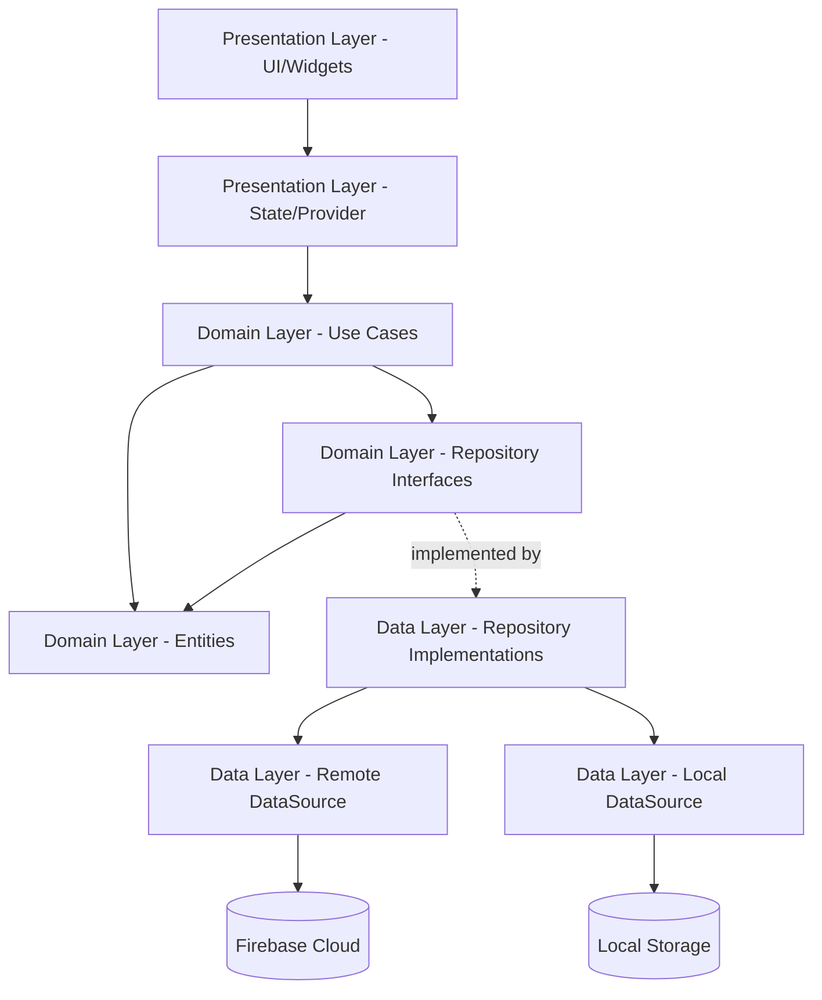
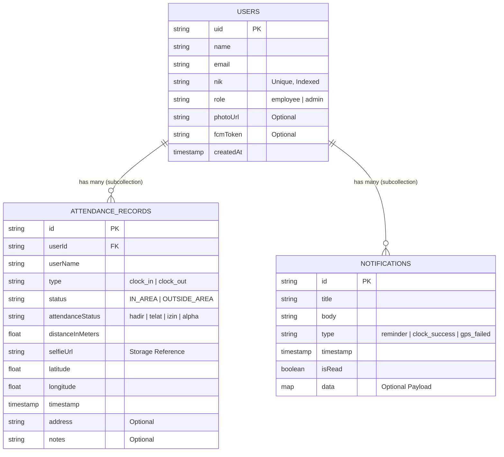

# 📘 KiniHadir - Technical & Architecture Documentation

Dokumen ini menjelaskan arsitektur *software*, *Entity-Relationship (ER) Diagram*, lapisan desain (*Clean Architecture*), dan antarmuka *Backend API* (Firebase) yang digunakan dalam aplikasi **KiniHadir**. 

Aplikasi ini menggunakan Flutter untuk *frontend* dan Firebase (*Auth, Firestore, Storage, Cloud Messaging*) untuk *backend*.

---

## 🏗️ 1. Architecture Overview (Clean Architecture)

Aplikasi ini mengadopsi pola **Clean Architecture** yang ketat, membagi *codebase* ke dalam beberapa lapisan independen untuk memastikan *scalability*, *testability*, dan pemeliharaan yang mudah.



### Penjelasan Lapisan (Layers):
1. **Core Layer (`lib/core/`)**: Berisi infrastruktur dasar (FCM Service, Routing, Themes, Constants, Error Handling, Validators).
2. **Domain Layer (`lib/domain/`)**: Inti bisnis logika. Sama sekali tidak memiliki dependensi pada *framework* Flutter atau package pihak ketiga. Mengandung *Entities*, *Repository Interfaces*, dan *Use Cases* (contoh: `ClockInUseCase`).
3. **Data Layer (`lib/data/`)**: Implementasi konkret dari komunikasi data eksternal. Menerjemahkan data JSON/Firestore menjadi *Entities* menggunakan *Models*.
4. **Presentation Layer (`lib/presentation/`)**: Layer *User Interface* (UI) yang mencakup layar (`screens`), komponen (`widgets`), dan *state management* (`providers`).

---

## 📊 2. Entity-Relationship (ER) Diagram

Karena menggunakan NoSQL (Firestore), skema ini menggambarkan struktur koleksi, sub-koleksi, dan referensi *document mapping*.



---

## 🔌 3. API & Service Documentation (Firebase)

Interaksi *client* dengan Firebase diabstraksi melalui *Remote DataSources*.

### A. Authentication API (`AuthRemoteDataSource`)
| Fungsi | Deskripsi | Return Type | Exception Handling |
|---|---|---|---|
| `loginWithEmail(email, pass)` | Autentikasi karyawan/admin via Email | `UserModel` | `AuthFailure` (Invalid Credential, dll) |
| `loginWithNik(nik, pass)` | Query `users` koleksi via NIK, ekstrak Email, lalu sign-in via Email Auth | `UserModel` | `AuthFailure` (NIK Not Found) |
| `sendPasswordResetEmail(email)`| Mengirim *reset link* bawaan Firebase | `void` | `AuthFailure` |
| `createEmployeeAccount(...)` | Membuat akun *auth* sekunder (untuk Admin) lalu menyimpan `nik` & profil ke Firestore | `UserModel` | `ServerFailure` |

### B. Attendance API (`AttendanceRemoteDataSource`)
| Koleksi / Path | Operasi | Keterangan Aturan (*Security Rules*) |
|---|---|---|
| `/attendance/{uid}/records` | `POST` (Add) | Wajib: `request.auth.uid == uid` |
| `/attendance/{uid}/records` | `GET` (List) | Karyawan hanya bisa melihat UID miliknya sendiri. Admin bisa melihat semua UID. |
| `/attendance/{uid}/records` | `GET` (Query) | Mendukung `where('timestamp', isGreaterThan: startOfDay)` untuk pengecekan limit absen harian. |

### C. Notification Services (`FcmService`)
- Menggunakan `flutter_local_notifications` untuk memicu notifikasi terjadwal (07:30 & 17:00).
- Menyimpan *Foreground Message* dari FCM Server Key langsung ke koleksi `/notifications/{uid}`.

---

## 🔒 4. Security & Offline Fallback

1. **GPS Spoofing Prevention**: Menggunakan `Geolocator` akurasi tinggi dan memvalidasi `distanceInMeters` di tingkat logika bisnis *sebelum* dikirim ke server.
2. **Face Matching & Alignment**: Integrasi **Google ML Kit** mendeteksi fitur mata dan hidung untuk mencegah foto palsu atau blank screen, lalu dikompresi sebelum diunggah ke *Firebase Storage*.
3. **Offline Handling**: Exception `unavailable` dari Firestore akan ditangkap oleh layer *Data*, dilempar sebagai `NetworkFailure`, lalu disajikan ke UI dengan instruksi "Cek Koneksi".
4. **Data Isolation**: Firestore Security Rules diatur ketat:
   ```javascript
   // Users can only read/write their own attendance
   match /attendance/{userId}/{document=**} {
      allow read, write: if request.auth != null && request.auth.uid == userId;
   }
   // Admins can read all
   match /attendance/{document=**} {
      allow read: if request.auth != null && get(/databases/$(database)/documents/users/$(request.auth.uid)).data.role == 'admin';
   }
   ```

---
*Dokumen ini dibuat secara otomatis untuk keperluan *Handover* (Serah Terima Proyek). Anda dapat menekan **CTRL+P / Print to PDF** di VSCode / Browser Markdown Viewer untuk mengekspor dokumen ini menjadi PDF.*
